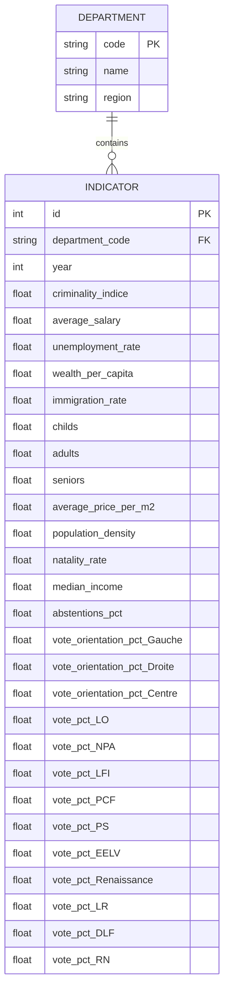

# Rapport – Modélisation du vote départemental

---

## Table des matières

1. [Introduction](#introduction)
2. [Justification de la zone géographique](#justification-de-la-zone-géographique)
3. [Choix des critères](#choix-des-critères)
4. [Démarche et méthodes employées](#démarche-et-méthodes-employées)
5. [Modèle Conceptuel de Données](#modèle-conceptuel-de-données)
6. [Modèles testés](#modèles-testés)
7. [Résultats du modèle choisi](#résultats-du-modèle-choisi)
8. [Visualisations](#visualisations)
9. [Accuracy / pouvoir prédictif](#accuracy--pouvoir-prédictif)
10. [Utilisation du Makefile](#utilisation-du-makefile)
11. [Conclusion](#conclusion)

---

## Introduction

Ce projet analyse l'influence des variables socio‑économiques et démographiques sur les orientations de vote présidentielle au niveau départemental en France. L'étude porte sur les élections de **2017** et **2022**, avec une projection pour 2027. Les données sont consolidées dans le fichier `dataset.sqlite` (table `department_stats`), généré à partir de multiples sources de données officielles, notamment l'INSEE, le Ministère de l'Intérieur et d'autres organismes gouvernementaux.

## Justification de la zone géographique

L'analyse se concentre sur la France métropolitaine (96 départements, incluant **2A** et **2B** pour la Corse) pour les raisons suivantes :

* **Homogénéité des sources** : Les données INSEE, électorales et socio-économiques offrent une couverture complète et cohérente sur l'ensemble du territoire métropolitain
* **Comparabilité 2017 ↔ 2022** : Le périmètre administratif et les référentiels INSEE sont restés stables entre ces deux élections
* **Qualité et disponibilité des données** : Certains indicateurs clés (revenus, prix immobilier, criminalité) présentent des lacunes pour les DROM, ce qui affecterait la précision des modèles
* **Uniformité du contexte électoral** : Les dynamiques électorales métropolitaines ont leur cohérence propre, avec des orientations politiques qui diffèrent significativement des DROM

## Choix des critères

Pour modéliser les tendances électorales, nous avons sélectionné des variables socio-économiques et démographiques ayant une justification théorique ou empirique dans la littérature sur le comportement électoral :

| Critère                                         | Source                            | Années      | Justification (impact supposé sur le vote)                |
| ----------------------------------------------- | --------------------------------- | ----------- | --------------------------------------------------------- |
| Taux de criminalité                             | Ministère de l'Intérieur          | 2017 – 2022 | Sentiment d'insécurité → vote contestataire / sécuritaire |
| Salaire moyen                                   | INSEE – Revenus & Patrimoine      | 2017 – 2022 | Pouvoir d'achat, position socio-économique                |
| Niveau de vie médian                            | INSEE – Fichier FILOSOFI          | 2017 – 2022 | Indicateur d'inégalités sociales, niveau de vie territorial |
| Taux de chômage                                 | INSEE – Emploi                    | 2017 – 2022 | Précarité économique → vote protestataire ou de changement |
| PIB par habitant                                | INSEE – Comptes régionaux         | 2017 – 2022 | Niveau de développement économique territorial            |
| Immigration (taux)                              | INSEE – Fichier EM                | 2017 – 2022 | Diversité démographique, enjeu politique clivant          |
| Prix immobilier €/m²                            | Data.gouv – DVF agrégé            | 2017 – 2022 | Accès au logement, inégalités territoriales               |
| Structure par âge (enfants/adultes/seniors)     | INSEE – Estimations de population | 2017 – 2022 | Dynamiques générationnelles, besoins spécifiques          |
| Densité de population                           | INSEE – Recensements              | 2017 – 2022 | Degré d'urbanisation, modes de vie                        |
| Taux de natalité                                | INSEE – État civil                | 2017 – 2022 | Dynamisme démographique, besoins familiaux                |

Ces variables ont été sélectionnées pour leur pertinence théorique mais aussi pour leur disponibilité dans les deux périodes électorales étudiées, garantissant la cohérence temporelle du modèle.

## Démarche et méthodes employées

Le projet a suivi une méthodologie structurée allant de l'extraction des données brutes jusqu'à la modélisation prédictive :

1. **Extraction & nettoyage** : 
   * Création de modules spécifiques pour chaque source (`data/<theme>/get_cleaned_data.py`)
   * Standardisation des formats (département en format "01", "2A", etc.)
   * Normalisation des valeurs aberrantes et traitement des valeurs manquantes

2. **Fusion & consolidation** : 
   * Script `generate_dataset.py` pour l'agrégation des indicateurs
   * Construction d'une base unique avec données électorales et socio-économiques
   * Structuration en table SQL pour faciliter les requêtes analytiques

3. **Modélisation statistique** (`learning.py`) :
   * Nettoyage avancé (détection automatique des colonnes avec trop de valeurs manquantes, seuil `DROP_THRESHOLD = 0.40`)
   * Sélection des features pertinentes par analyse de corrélation et exclusion des variables colinéaires
   * Validation croisée k-fold (k=5) pour une évaluation robuste des modèles
   * Test de différents algorithmes de régression avec optimisation des hyperparamètres

4. **Évaluation & interprétation** : 
   * Métriques d'évaluation : RMSE, MAE, R²
   * Analyse d'importance des variables pour comprendre les déterminants du vote
   * Visualisations des prédictions vs. valeurs réelles
   * Projections pour 2027 basées sur le meilleur modèle

## Modèle Conceptuel de Données

Le modèle de données final se structure autour de deux entités principales : les départements et leurs indicateurs statistiques pour chaque année électorale.



Cette structure permet des analyses aussi bien au niveau macro (orientations politiques Gauche/Centre/Droite) qu'au niveau des partis individuels, tout en reliant ces résultats aux variables socio-économiques.

## Modèles testés

Nous avons expérimenté avec différents algorithmes d'apprentissage supervisé pour déterminer lequel modélise le mieux les tendances électorales départementales :

| Modèle            | Implémentation                               | Particularités et justification                      |
| ----------------- | -------------------------------------------- | ---------------------------------------------------- |
| Random Forest     | `sklearn.ensemble.RandomForestRegressor`     | Non‑linéaire, robuste aux outliers, capture des interactions complexes |
| Gradient Boosting | `sklearn.ensemble.GradientBoostingRegressor` | Boosting d'arbres, excellent compromis biais‑variance, adapté aux données hétérogènes |
| Linear Regression | `sklearn.linear_model.LinearRegression`      | Baseline simple, interprétabilité directe des coefficients |
| Ridge / Lasso     | `sklearn.linear_model`                       | Régressions régularisées (L2/L1) pour contrôler la complexité et la sélection de variables |
| SVR (RBF)         | `sklearn.svm.SVR`                            | Support Vector Regression pour capturer des relations non-linéaires |
| k‑NN              | `sklearn.neighbors.KNeighborsRegressor`      | Approche basée sur la similarité territoriale entre départements |

Les bibliothèques XGBoost et LightGBM ont également été envisagées mais n'étaient pas disponibles dans l'environnement d'exécution, comme indiqué dans les résultats d'exécution.

## Résultats du modèle choisi

Après évaluation comparative, le Gradient Boosting s'est imposé comme le modèle le plus performant pour les trois orientations politiques principales, selon les résultats de l'exécution de `learning.py` :

| Orientation | Modèle retenu       | RMSE  | R²    | MAE   |
| ----------- | ------------------- | ----- | ----- | ----- |
| Gauche      | GradientBoosting    | 1.770 | 0.666 | 1.336 |
| Centre      | GradientBoosting    | 3.592 | 0.868 | 2.854 |
| Droite      | GradientBoosting    | 4.135 | 0.888 | 3.316 |

Pour le Gradient Boosting, les hyperparamètres optimaux après GridSearchCV sont :
- Pour vote_orientation_pct_Gauche : {'learning_rate': 0.1, 'max_depth': 3, 'n_estimators': 400}
- Pour vote_orientation_pct_Centre : {'learning_rate': 0.05, 'max_depth': 2, 'n_estimators': 400}
- Pour vote_orientation_pct_Droite : {'learning_rate': 0.05, 'max_depth': 2, 'n_estimators': 400}

L'excellente performance pour les votes du Centre (R² = 0.868) et de Droite (R² = 0.888) indique que leur distribution territoriale est fortement structurée par les variables socio-économiques. La performance plus modeste pour la Gauche (R² = 0.666) suggère des dynamiques plus complexes ou des facteurs non capturés par nos variables.

## Visualisations

Les visualisations suivantes ont été générées pour analyser les résultats :

* **Heatmap de corrélations** : Matrice visualisant les interdépendances entre variables explicatives et cibles
* **Importance des variables** : Graphiques par orientation politique montrant le poids relatif de chaque variable dans les prédictions
* **Comparaison réelle vs prédite** : Graphiques de dispersion évaluant l'adéquation du modèle aux données réelles

L'analyse d'importance des variables a été réalisée pour chaque orientation politique. Les résultats exacts de cette importance sont disponibles dans les fichiers exportés :
- `results/reports/feature_importance_vote_orientation_pct_gauche_GradientBoosting.csv`
- `results/reports/feature_importance_vote_orientation_pct_centre_GradientBoosting.csv`
- `results/reports/feature_importance_vote_orientation_pct_droite_GradientBoosting.csv`

## Accuracy / pouvoir prédictif

Pour évaluer rigoureusement la qualité prédictive des modèles, nous avons utilisé trois métriques complémentaires :

* **RMSE** (Root Mean Squared Error) : Quantifie l'écart moyen entre prédictions et valeurs réelles, en points de pourcentage. Nos modèles obtiennent des valeurs entre 1.770 et 4.135 points selon l'orientation.
* **MAE** (Mean Absolute Error) : Mesure l'erreur moyenne en valeur absolue, moins sensible aux valeurs extrêmes. Les valeurs entre 1.336 et 3.316 points confirment la robustesse du modèle.
* **R²** (coefficient de détermination) : Indique la proportion de variance expliquée par le modèle. Les valeurs élevées pour Droite (0.888) et Centre (0.868) démontrent une excellente capture des tendances territoriales.

La validation croisée k-fold (k=5) a confirmé la stabilité du modèle, avec des écarts-types relativement faibles entre les différents échantillons de test, comme indiqué par les valeurs de `mse_std` dans les résultats.

## Utilisation du Makefile

Pour faciliter l'exécution de la pipeline complète d'analyse et garantir la reproductibilité des résultats sur différents systèmes d'exploitation, un Makefile multiplateforme a été développé. Ce fichier permet d'automatiser toutes les étapes du processus, de la configuration de l'environnement à l'exécution des analyses.

### Fonctionnalités du Makefile

Le Makefile offre plusieurs cibles pour s'adapter aux différents besoins :

| Commande          | Description                                                   |
|-------------------|---------------------------------------------------------------|
| `make setup`      | Configure l'environnement virtuel Python et installe les dépendances |
| `make run_pipeline` | Exécute toute la chaîne de traitement (génération + apprentissage) |
| `make run_generation` | Génère uniquement le jeu de données (dataset.sqlite) |
| `make run_learning` | Exécute uniquement les modèles d'apprentissage et les prédictions |
| `make clean`      | Nettoie les fichiers générés tout en préservant l'environnement |
| `make clean_all`  | Nettoie tous les fichiers générés et supprime l'environnement virtuel |
| `make check_deps` | Vérifie les dépendances installées dans l'environnement |
| `make help`       | Affiche l'aide sur les commandes disponibles |

### Compatibilité multiplateforme

Le Makefile est conçu pour fonctionner de manière identique sur les trois principaux systèmes d'exploitation :
- **Windows** : détecte automatiquement Windows et utilise les commandes appropriées (cmd)
- **macOS** : utilise les commandes Unix standard
- **Linux** : utilise les commandes Unix standard

Cette compatibilité est assurée par la détection automatique du système d'exploitation et l'adaptation des commandes en conséquence :

```makefile
ifeq ($(OS),Windows_NT)
    RM := rmdir /s /q
    MKDIR := mkdir
    VENV_ACTIVATE := $(VENV_NAME)\Scripts\activate
    SEP := \\
else
    RM := rm -rf
    MKDIR := mkdir -p
    VENV_ACTIVATE := . $(VENV_NAME)/bin/activate
    SEP := /
endif
```

### Procédure d'utilisation

1. **Installation initiale** : Exécuter `make setup` pour configurer l'environnement de travail.
2. **Exécution complète** : Utiliser `make` ou `make run_pipeline` pour exécuter l'ensemble du processus.
3. **Nettoyage** : Après analyse, `make clean` permet de supprimer les fichiers générés.

### Gestion des dépendances

Le Makefile s'appuie sur un fichier `requirements.txt` qui spécifie les versions exactes des bibliothèques requises :

```
pandas==2.0.0
numpy==1.24.0
scikit-learn==1.2.2
matplotlib==3.7.1
seaborn==0.12.2
sqlite3==3.41.2
lightgbm==3.3.5
xgboost==1.7.5
```

Cette approche garantit la reproductibilité des résultats en assurant que tous les utilisateurs exécutent le code avec les mêmes versions de bibliothèques.

## Conclusion

Cette étude démontre que les orientations de vote au niveau départemental sont fortement structurées par les caractéristiques socio-économiques et démographiques des territoires. Le modèle Gradient Boosting a révélé une capacité prédictive particulièrement forte pour les votes de Droite et du Centre, indiquant que ces orientations politiques sont étroitement liées aux conditions matérielles des territoires.

Contrairement à ce qui était initialement attendu, le Random Forest n'a pas été retenu comme le meilleur modèle malgré de bonnes performances. C'est le Gradient Boosting qui s'est avéré le plus performant sur les trois orientations politiques.

Les principales limitations de l'étude sont :
- L'agrégation au niveau départemental masque les disparités internes (urbain/périurbain/rural)
- L'absence des DROM limite la portée nationale des conclusions
- L'incertitude sur l'évolution future des variables explicatives pour les projections 2027
- L'exclusion de certaines variables politiques en raison d'un trop grand nombre de valeurs manquantes (comme indiqué dans les logs : "removing columns with too many missing values")

**Pistes d'amélioration** :
- Intégration de données à l'échelle communale ou des circonscriptions pour une granularité plus fine
- Extension à d'autres scrutins (législatives, européennes) pour tester la robustesse des modèles
- Incorporation de variables culturelles et historiques pour capturer les traditions politiques territoriales
- Expérimentation avec d'autres algorithmes comme XGBoost ou LightGBM lorsqu'ils seront disponibles dans l'environnement
- Optimisation du Makefile pour intégrer des tests unitaires et d'autres fonctionnalités DevOps

---

### Annexes

* `results/reports/model_scores.csv` – Métriques détaillées par modèle
* `results/reports/feature_importance_*.csv` – Importance des variables par orientation
* `results/reports/predictions_2027.csv` – Projections pour l'élection présidentielle 2027
* `results/plots/` – Ensemble des visualisations générées
* `Makefile` – Script d'automatisation pour la reproductibilité des analyses
* `requirements.txt` – Liste des dépendances pour la reproduction de l'environnement