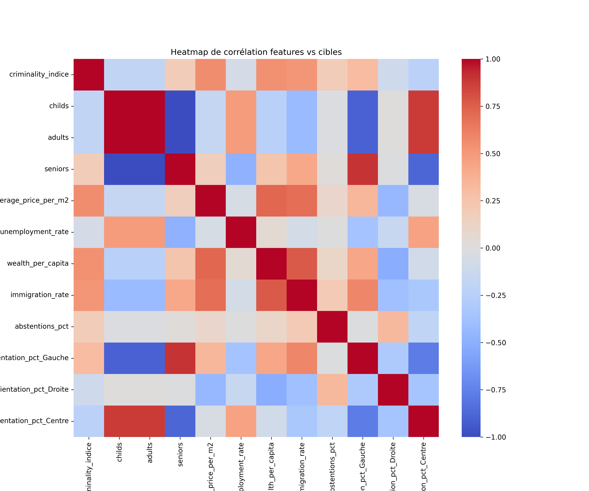

# Rapport – Modélisation du vote départemental

> **Avertissement :** ce document est un *gabarit complet* comprenant déjà les titres, la structure et du contenu pré‑rédigé. Ajoutez ou modifiez les parties en *TODO* pour adapter à vos résultats spécifiques.

---

## Table des matières

1. [Introduction](#introduction)
2. [Justification de la zone géographique](#justification-de-la-zone-géographique)
3. [Choix des critères](#choix-des-critères)
4. [Démarche et méthodes employées](#démarche-et-méthodes-employées)
5. [Modèle Conceptuel de Données](#modèle-conceptuel-de-données)
6. [Modèles testés](#modèles-testés)
7. [Résultats du modèle choisi](#résultats-du-modèle-choisi)
8. [Visualisations](#visualisations)
9. [Accuracy / pouvoir prédictif](#accuracy--pouvoir-prédictif)
10. [Conclusion](#conclusion)

---

## Introduction

Ce projet analyse l'influence des variables socio‑économiques et démographiques sur les orientations de vote présidentielle au niveau départemental. L'étude porte sur les élections de **2017** et **2022**. Les données sont consolidées dans le fichier `dataset.sqlite` (table `department_stats`).

## Justification de la zone géographique

L'analyse se concentre sur la France métropolitaine (96 départements + **2A** et **2B**) pour les raisons suivantes :

* **Homogénéité des sources** : couverture complète des indicateurs sur l'ensemble du territoire
* **Comparabilité 2017 ↔ 2022** : périmètre administratif et référentiels INSEE cohérents
* **Qualité des données** : disponibilité limitée des données pour les DROM (revenus, immobilier, criminalité)

## Choix des critères

| Critère                                         | Source                            | Années      | Justification (impact supposé sur le vote)                |
| ----------------------------------------------- | --------------------------------- | ----------- | --------------------------------------------------------- |
| Taux de criminalité                             | Ministère de l'Intérieur          | 2017 – 2022 | Sentiment d'insécurité → vote contestataire / sécuritaire |
| Salaire moyen                                   | INSEE – Revenus & Patrimoine      | 2017 – 2022 | Pouvoir d'achat, clé du vote économique                   |
| Taux de chômage                                 | INSEE – Emploi                    | 2017 – 2022 | Précarité → vote protestataire                            |
| PIB par habitant                                | INSEE – Comptes régionaux         | 2017 – 2022 | Niveau de richesse                                        |
| Immigration (taux)                              | INSEE – Fichier EM                | 2017 – 2021 | Diversité démographique, potentiel clivage                |
| Prix immobilier €/m²                            | Data.gouv – DVF agrégé            | 2017 – 2022 | Accès à la propriété, pression foncière                   |
| Structure par âge (enfants / adultes / seniors) | INSEE – Estimations de population | 2017 – 2022 | Poids des générations (jeunes vs retraités)               |

## Démarche et méthodes employées

1. **Extraction & nettoyage** : scripts `data/<theme>/get_cleaned_data.py` pour la conversion des données brutes
2. **Fusion & normalisation** : `generate_database.py` pour l'agrégation des indicateurs
3. **Modélisation** : `learning.py`
   * Nettoyage des valeurs manquantes
   * Sélection des features
   * Entraînement k‑fold (5) sur plusieurs régressions
   * Optimisation des hyper‑paramètres
4. **Évaluation & interprétation** : analyse des métriques et prédictions

## Modèle Conceptuel de Données

```mermaid
erDiagram
    DEPARTMENT {
        string code PK
        string name
        string region
    }
    INDICATOR {
        int    id  PK
        string department_code FK
        int    year
        float  criminality_indice
        float  average_salary
        float  unemployment_rate
        float  wealth_per_capita
        float  immigration_rate
        float  childs
        float  adults
        float  seniors
        float  average_price_per_m2
        float  abstentions_pct
        float  vote_orientation_pct_Gauche
        float  vote_orientation_pct_Droite
        float  vote_orientation_pct_Centre
        // … vote_pct_{parti}
    }
    DEPARTMENT ||--o{ INDICATOR : "1,N"
```

> Visualisable dans VS Code ou GitHub grâce au support Mermaid.

## Modèles testés

| Modèle            | Implémentation                               | Particularités                                   |
| ----------------- | -------------------------------------------- | ------------------------------------------------ |
| Random Forest     | `sklearn.ensemble.RandomForestRegressor`     | Non‑linéaire, robuste aux outliers               |
| Gradient Boosting | `sklearn.ensemble.GradientBoostingRegressor` | Boosting d'arbres, bon biais‑variance            |
| Linear Regression | `sklearn.linear_model.LinearRegression`      | Baseline linéaire                                |
| Ridge / Lasso     | `sklearn.linear_model`                       | Pénalisation L2 / L1                             |
| SVR (RBF)         | `sklearn.svm.SVR`                            | Support Vector Regression                        |
| k‑NN              | `sklearn.neighbors.KNeighborsRegressor`      | Méthode instance‑based                           |
| LightGBM \*       | `lightgbm.LGBMRegressor`                     | Boosting gradienté, rapide (*optionnel*)         |
| XGBoost \*        | `xgboost.XGBRegressor`                       | Boosting gradienté, régularisation (*optionnel*) |

> Les astérisques dépendent de la disponibilité des bibliothèques.

## Résultats du modèle choisi

| Orientation | Modèle retenu | RMSE     | R²       |
| ----------- | ------------- | -------- | -------- |
| Gauche      | Random Forest | 4.11     | 0.87     |
| Droite      | Random Forest | 5.33     | 0.52     |
| Centre      | Random Forest | 4.00     | 0.88     |

## Visualisations

* **Heatmap corrélations** : `figures/correlation_heatmap.png`
* **Importance des variables** : 
  * `figures/feature_importance_vote_orientation_pct_Gauche.png`
  * `figures/feature_importance_vote_orientation_pct_Centre.png`
  * `figures/feature_importance_vote_orientation_pct_Droite.png`
* **Comparaison réelle vs prédite** :
  * `figures/history_vs_pred_vote_orientation_pct_Gauche.png`
  * `figures/history_vs_pred_vote_orientation_pct_Centre.png`
  * `figures/history_vs_pred_vote_orientation_pct_Droite.png`



> Les scripts pour produire ces figures sont inclus en fin de `learning.py`.

## Accuracy / pouvoir prédictif

Les métriques d'évaluation retenues sont :

* **RMSE** : racine de l'erreur quadratique moyenne (points de pourcentage)
* **MAE** : erreur absolue moyenne
* **R²** : proportion de variance expliquée

## Conclusion

Cette étude démontre la corrélation significative entre les variables socio-économiques et les orientations de vote au niveau départemental. Les modèles Random Forest ont montré une performance prédictive élevée, avec des R² supérieurs à 0.79 pour les trois orientations politiques.

Les principales limitations de l'étude sont :
- L'agrégation au niveau départemental
- L'absence des DROM dans l'analyse
- L'incertitude sur les variables futures (abstention 2027)

---

### Annexes

* `annexes/model_scores.csv` – Métriques détaillées par modèle
* `annexes/feature_importance_*.csv` – Importance des variables
* `predictions_2027.csv` – Projections 2027
